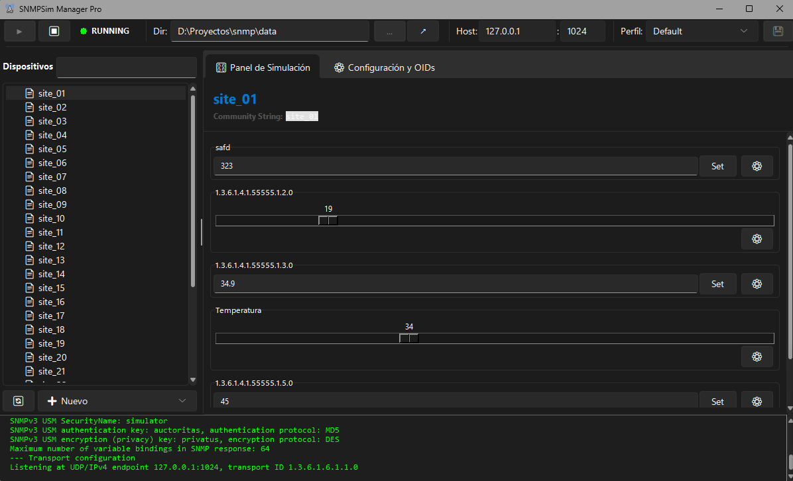

# 📡 SNMP Simulator Manager GUI


A robust tool with a modern graphical interface designed to manage and run SNMP simulations effortlessly. This project acts as a visual wrapper for `snmpsim-lextudio`, allowing network administrators and developers to test Network Management Systems (NMS) without the need for physical hardware.


## ✨ Key Features
- 📂 **File Explorer**: Integrated sidebar for fast navigation between `.snmprec` files.
- ✍️ **Data Editor**: Modify OIDs and values directly from the app with instant saving.
- 🚀 **Async Engine**: Implementation compatible with `asyncio` changes in Python 3.12+.
- 📊 **Live Console**: Real-time visualization of SNMP engine logs and output.
- 🛡️ **Status Bar**: Dynamic execution indicators and file count tracking.

## 📸 Preview
> 


## 🚀 Installation & Setup

### Prerequisites
* **Python 3.12 or higher** (Optimized for Python 3.14).

### Steps
1. **Clone the repository:**
   ```bash
   git clone https://github.com/Onydarius/snmpsim-gui2.git
   cd snmpsim-gui2
   ```
2. **Install dependencies:**
    ```bash
    pip install -r requirements.txt
    ```
3. **Run the application:**
    ```bash
    python main.py
    ```


###  💻 Usage Instructions

- **Configuration**: Set the Host IP (e.g., 127.0.0.1) and Port (e.g., 1024) in the top bar.

- **Data Selection:** Select an .snmprec file from the left panel to view or edit its records.

- **Simulation:** Press the START ⏵ button to activate the SNMP Agent.

- **Testing:** Use the included test_snmp.py script to perform GET requests and verify the simulator's responses.

## 📂 Project Structure
- **main.py**: Main entry point.

- **gui/:** Interface modules (TopBar, Content, App).

- **gui/launcher.py:** Special wrapper for asynchronous loop compatibility in modern Python versions.

- **assets/:** Icons, visual resources, and application branding.

- **data/:** Default directory for SNMP recording files.


## 👨‍💻 Developed by
Ricardo Rubio V. Software Developer & Network Specialist

This project is open-source under the MIT License.